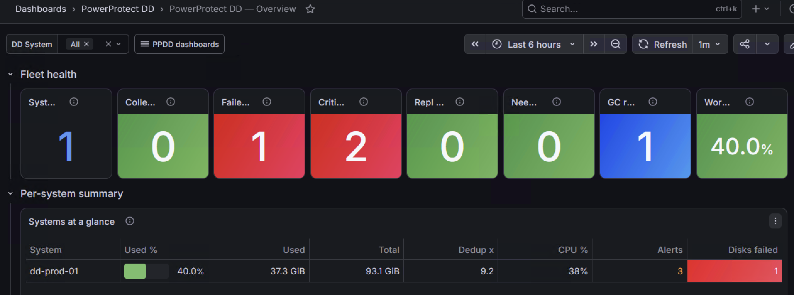
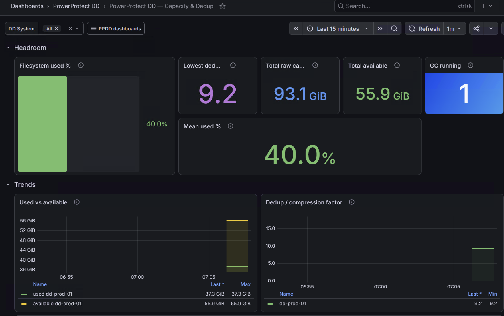
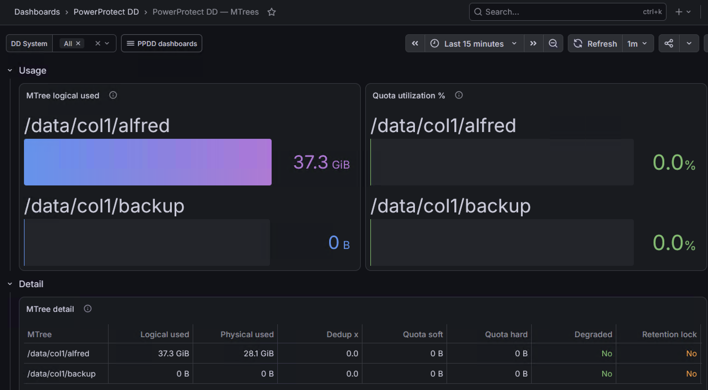
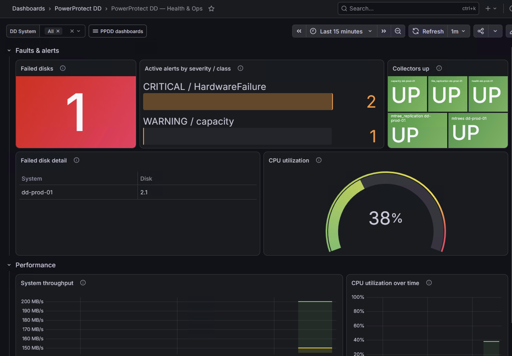

# End-to-end demo (Compose)

Two Docker Compose stacks (at the repo root, mirroring `pflex_exporter`) bring up the full
observability path — **mockdd → exporter → Prometheus → Grafana** — so you can see the
dashboard populated without a real Data Domain appliance.

`mockdd` is a tiny fake DD appliance (`cmd/mockdd`) that serves the same REST surface the
exporter calls, returning demo fixtures over self-signed TLS on `:3009`. It is a demo aid,
not a faithful emulator.

## Two stacks

| File | Exporter source |
|---|---|
| `docker-compose.yml` | **Built from source** (the repo `Dockerfile`) |
| `docker-compose.ghcr.yml` | **Pulled from GHCR** (`ghcr.io/fjacquet/ppdd_exporter`) |

Both are identical otherwise (the `mockdd` image is built locally in both — there is no
published mock image). Prometheus and Grafana use `:latest`, matching `pflex_exporter`.

## Run it

From the repo root (requires a running Docker daemon, and Docker Compose v2 — use
`docker compose`, not the older hyphenated `docker-compose`):

```bash
make demo          # build the exporter from source
make demo-ghcr     # …or run the published image instead
make demo-down     # stop and remove both stacks
```

Equivalently, the raw commands:

```bash
docker compose up --build                          # build stack (docker-compose.yml)
docker compose -f docker-compose.ghcr.yml up       # GHCR stack
# pin a tag: PPDD_TAG=0.1.0 docker compose -f docker-compose.ghcr.yml up
```

Then open:

- **Grafana** — <http://localhost:3000> (admin / admin) → folder *PowerProtect DD*, which auto-provisions five linked dashboards (use the **PPDD dashboards** dropdown in the top-left of any one to jump between them):
  - **PowerProtect DD — Overview** — NOC at-a-glance: fleet KPI row + per-system summary table.
  - **PowerProtect DD — Capacity & Dedup** — utilization, dedup/compression trends, GC activity.
  - **PowerProtect DD — MTrees** — per-MTree usage, quota utilization, protection flags.
  - **PowerProtect DD — Replication** — MTree contexts (state/connected/resync) + file replication.
  - **PowerProtect DD — Health & Ops** — failed disks, alerts, CPU, throughput, collector health.

  The Prometheus datasource and all dashboards are auto-provisioned.
- **Prometheus** — <http://localhost:9090>
- **Exporter** — <http://localhost:9441/metrics> and <http://localhost:9441/health>

Tear down with `make demo-down` (or `docker compose down`).

## What it looks like

Captured from the Compose demo, against `mockdd` fixtures (system `dd-prod-01`).

### Overview

Fleet KPI row plus the per-system summary table.



### Capacity & Dedup

Filesystem headroom, dedup/compression factor, and GC activity.



### MTrees

Per-MTree logical usage and quota utilization, with the detail table joined by MTree.



### Health & Ops

Failed disks, active alerts by severity/class, CPU, throughput, and per-collector health.



## What's wired

- `mockdd` serves the fixtures from `cmd/mockdd/fixtures/` (capacity, 4 MTrees, 2
  replication contexts incl. one *lagging*, a failed disk, alerts by severity, system perf).
- The exporter uses `config.demo.yaml` (a 30s interval for a snappy demo) pointed at the
  `mockdd` service.
- Prometheus scrapes `ppdd_exporter:9441` (`prometheus.yml`).
- Grafana provisioning lives in `grafana/provisioning/`; the canonical dashboard JSON lives in
  `grafana/dashboards/` (`ppdd-overview`, `ppdd-capacity`, `ppdd-mtrees`, `ppdd-replication`,
  `ppdd-health`), all tagged `ppdd` and cross-linked.

## Pointing at a real appliance

Edit `config.demo.yaml` (or mount your own): set `host` to your DD, supply real credentials
(use a read-only/monitor user; `${ENV}` interpolation and `passwordFile` are supported), and
remove the `mockdd` service from the compose file.
